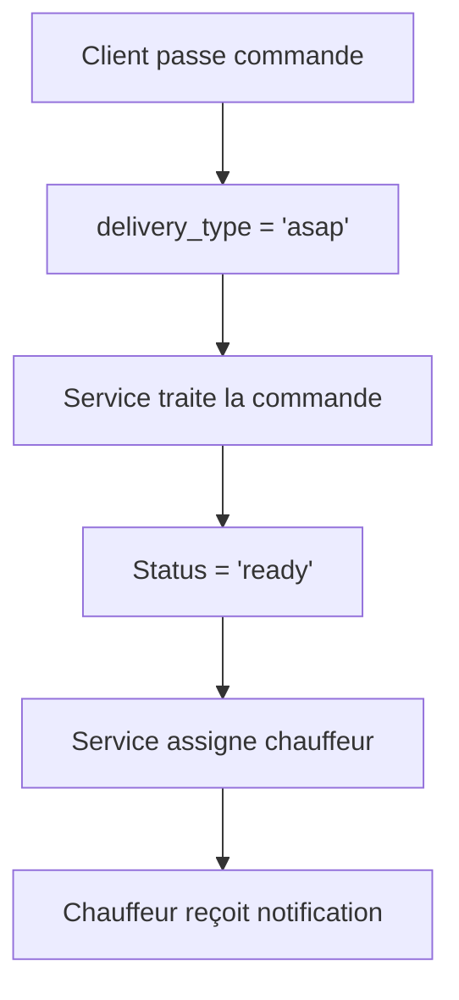
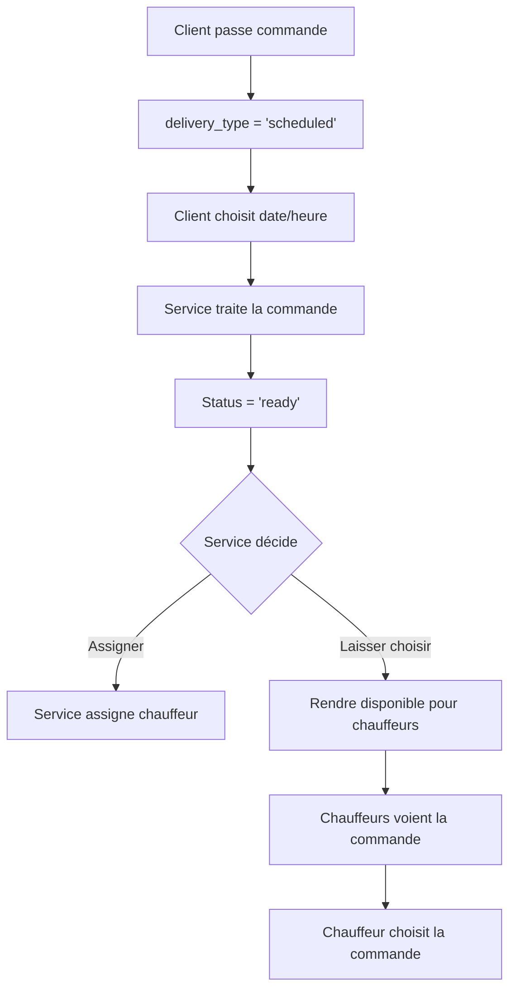

# 🚚 Système de Livraison Programmée - Documentation Technique

## 📋 Vue d'ensemble

Le système de livraison programmée permet aux clients de choisir une date et heure de livraison future, avec une gestion intelligente de l'assignation des chauffeurs selon le type de commande.

## 🏗️ Architecture du Système

### Types de Livraison

1. **ASAP (As Soon As Possible)**
   - Livraison immédiate
   - Le service assigne obligatoirement un chauffeur
   - Pas de choix pour les chauffeurs

2. **Scheduled (Programmée)**
   - Livraison à une date/heure spécifique
   - Le service peut assigner OU laisser les chauffeurs choisir
   - Gestion des créneaux disponibles

## 🗄️ Structure de la Base de Données

### Modifications de la Table `orders`

```sql
-- Nouveaux champs ajoutés
preferred_delivery_time timestamp with time zone,        -- Date/heure souhaitée
delivery_type character varying DEFAULT 'asap',          -- 'asap' ou 'scheduled'
available_for_drivers boolean DEFAULT false,             -- Disponible pour les chauffeurs
scheduled_delivery_window_start timestamp with time zone, -- Début de la fenêtre
scheduled_delivery_window_end timestamp with time zone,   -- Fin de la fenêtre
```

### Nouvelles Tables

#### `delivery_time_slots`
Gère les créneaux de livraison disponibles par jour de la semaine.

#### `available_orders`
Stocke les commandes disponibles pour les chauffeurs.

## 🔄 Flux de Fonctionnement

### 1. Commande ASAP



### 2. Commande Programmée



## 🛠️ Implémentation Technique

### 1. Interface Client

#### Composant de Sélection de Date
```typescript
interface DeliveryTimeSelector {
  deliveryType: 'asap' | 'scheduled';
  preferredTime?: Date;
  availableSlots?: TimeSlot[];
}
```

#### Validation des Créneaux
```typescript
const checkSlotAvailability = async (
  businessId: number,
  deliveryDate: Date,
  deliveryTime: string
): Promise<boolean> => {
  // Appel à la fonction SQL check_delivery_slot_availability
};
```

### 2. Interface Service (Backend)

#### API Endpoints

```typescript
// Récupérer les créneaux disponibles
GET /api/businesses/:id/delivery-slots?date=2024-01-15

// Créer une commande avec livraison programmée
POST /api/orders
{
  "delivery_type": "scheduled",
  "preferred_delivery_time": "2024-01-15T18:00:00Z",
  // ... autres données
}

// Rendre une commande disponible pour les chauffeurs
POST /api/orders/:id/make-available

// Assigner un chauffeur à une commande
POST /api/orders/:id/assign-driver
{
  "driver_id": "uuid"
}
```

### 3. Interface Chauffeur

#### Récupération des Commandes Disponibles
```typescript
// Récupérer les commandes disponibles
GET /api/drivers/available-orders

// Accepter une commande
POST /api/drivers/orders/:id/accept
```

## 📱 Intégration dans l'Application Mobile

### 1. Page de Commande

#### Étape de Sélection de Livraison
```typescript
// Composant de sélection du type de livraison
const DeliveryTypeSelector = () => {
  const [deliveryType, setDeliveryType] = useState<'asap' | 'scheduled'>('asap');
  const [selectedDateTime, setSelectedDateTime] = useState<Date | null>(null);
  
  return (
    <View>
      <TouchableOpacity onPress={() => setDeliveryType('asap')}>
        <Text>Livraison immédiate</Text>
      </TouchableOpacity>
      
      <TouchableOpacity onPress={() => setDeliveryType('scheduled')}>
        <Text>Livraison programmée</Text>
      </TouchableOpacity>
      
      {deliveryType === 'scheduled' && (
        <DateTimePicker
          value={selectedDateTime}
          onChange={setSelectedDateTime}
          minimumDate={new Date()}
        />
      )}
    </View>
  );
};
```

### 2. Validation des Créneaux

```typescript
const validateDeliverySlot = async (dateTime: Date) => {
  try {
    const response = await fetch(`/api/validate-slot`, {
      method: 'POST',
      body: JSON.stringify({
        business_id: businessId,
        delivery_date: dateTime.toISOString().split('T')[0],
        delivery_time: dateTime.toTimeString().split(' ')[0]
      })
    });
    
    const { available } = await response.json();
    return available;
  } catch (error) {
    console.error('Erreur validation créneau:', error);
    return false;
  }
};
```

## 🔧 Fonctions SQL Utiles

### 1. Vérifier la Disponibilité d'un Créneau
```sql
SELECT check_delivery_slot_availability(
  business_id,
  '2024-01-15'::date,
  '18:00:00'::time
);
```

### 2. Rendre une Commande Disponible
```sql
SELECT make_order_available_for_drivers('order-uuid');
```

### 3. Assigner un Chauffeur
```sql
SELECT assign_driver_to_order('order-uuid', 'driver-uuid');
```

### 4. Nettoyer les Commandes Expirées
```sql
SELECT cleanup_expired_available_orders();
```

## 📊 Gestion des Créneaux

### Configuration des Créneaux par Défaut

Le système inclut des créneaux prédéfinis :

- **Lundi à Vendredi** : 8h-12h, 12h-14h, 18h-22h
- **Samedi et Dimanche** : 10h-14h, 18h-23h

### Personnalisation par Restaurant

Chaque restaurant peut définir ses propres créneaux :

```sql
INSERT INTO delivery_time_slots (
  business_id, 
  day_of_week, 
  start_time, 
  end_time, 
  max_orders_per_slot
) VALUES (
  1,           -- ID du restaurant
  1,           -- Lundi
  '09:00:00',  -- 9h
  '13:00:00',  -- 13h
  15           -- Max 15 commandes
);
```

## 🔔 Notifications

### Notifications pour les Chauffeurs

1. **Nouvelle commande assignée** (ASAP)
2. **Nouvelle commande disponible** (Scheduled)
3. **Commande expirée** (si non acceptée)

### Notifications pour les Clients

1. **Confirmation de commande programmée**
2. **Rappel de livraison** (1h avant)
3. **Chauffeur assigné**
4. **Livraison en cours**

## 🧪 Tests

### Tests de Validation des Créneaux

```typescript
describe('Delivery Slot Validation', () => {
  it('should validate available slot', async () => {
    const result = await checkSlotAvailability(1, new Date('2024-01-15'), '18:00');
    expect(result).toBe(true);
  });
  
  it('should reject unavailable slot', async () => {
    // Simuler un créneau plein
    const result = await checkSlotAvailability(1, new Date('2024-01-15'), '12:00');
    expect(result).toBe(false);
  });
});
```

### Tests d'Assignation

```typescript
describe('Driver Assignment', () => {
  it('should assign driver to ASAP order', async () => {
    const order = await createOrder({ delivery_type: 'asap' });
    const driver = await assignDriver(order.id);
    expect(driver).toBeDefined();
  });
  
  it('should make scheduled order available', async () => {
    const order = await createOrder({ delivery_type: 'scheduled' });
    await makeOrderAvailable(order.id);
    const availableOrders = await getAvailableOrders();
    expect(availableOrders).toContain(order.id);
  });
});
```

## 🚀 Déploiement

### 1. Exécuter le Script SQL
```bash
# Dans l'éditeur SQL de Supabase
# Exécuter le contenu de database/delivery-scheduling-schema.sql
```

### 2. Mettre à Jour l'Application
```bash
# Ajouter les nouveaux composants
# Mettre à jour les services
# Tester les nouvelles fonctionnalités
```

### 3. Configuration des Créneaux
```bash
# Personnaliser les créneaux par restaurant si nécessaire
# Configurer les limites de commandes
```

## 📈 Métriques et Monitoring

### KPIs à Surveiller

1. **Taux d'acceptation des commandes programmées**
2. **Temps moyen d'assignation**
3. **Taux de commandes expirées**
4. **Satisfaction client**

### Logs Importants

```typescript
// Logs à implémenter
logger.info('Order scheduled', { orderId, deliveryTime });
logger.warn('Order expired', { orderId, expiresAt });
logger.error('Slot validation failed', { businessId, date, time });
```

## 🔒 Sécurité

### Contrôles d'Accès

1. **Validation des permissions** pour l'assignation
2. **Vérification de l'appartenance** des commandes
3. **Protection contre les modifications** non autorisées

### Validation des Données

1. **Vérification des dates** (pas de dates passées)
2. **Validation des créneaux** (dans les horaires autorisés)
3. **Contrôle des limites** (max_orders_per_slot)

## 📞 Support

Pour toute question ou problème lié au système de livraison programmée, consultez :

1. **Documentation technique** : Ce fichier
2. **Logs d'erreur** : Console Supabase
3. **Métriques** : Dashboard de monitoring
4. **Support technique** : Équipe de développement 